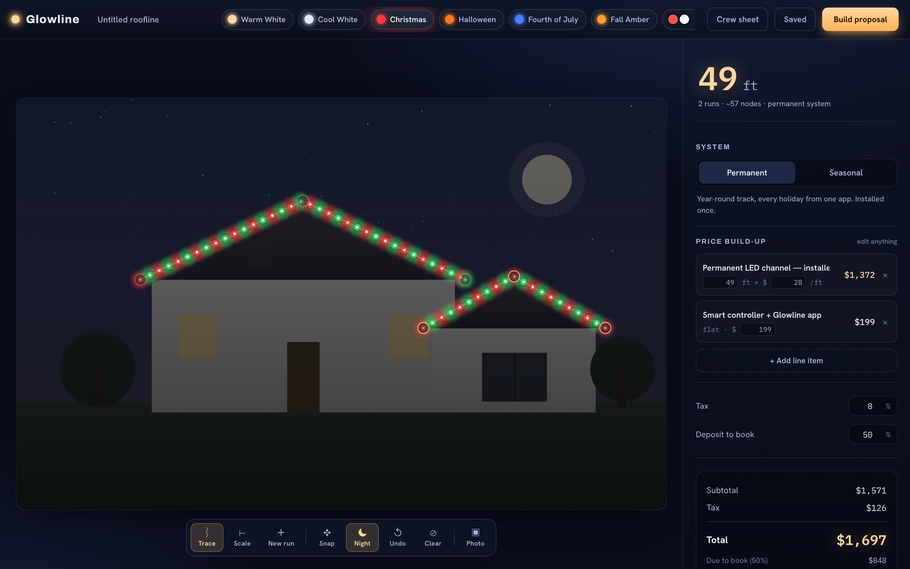

# Glowline

**Sell the house before you light it.** Glowline is the kitchen-table sales tool for
permanent & holiday lighting installers: trace a customer's roofline on a photo of
*their* house, preview it glowing in any season, and hand them a priced, branded
proposal — in one flow, on one screen.

**▶ Live site: https://anthony-michael.github.io/glowline/** · **the app: [/app.html](https://anthony-michael.github.io/glowline/app.html)**

 



---

## Why this exists (the business case)

Permanent exterior lighting is one of the fastest-growing home services in North America
— roughly **45–60% YoY**, average project **~$6,000**, margins above the trade average.
The software around it splits awkwardly in two:

- **Full CRMs** (Jobber, QuoteIQ, JingleCRM) — great at scheduling, invoicing, rebooking.
- **A visual mockup tool** (Strandr) — used *separately* to show the customer the look.

Installers pay for both and stitch them together. The highest-leverage moment — the one
that actually **closes the $6k sale at the doorstep** — is the visual "here's *your* house,
lit" conversation. That's the wedge Glowline owns, and it ships the priced proposal in the
same breath instead of bouncing to a second tool.

**Monetization:** $39/mo per installer (self-serve), or per-proposal credits for
seasonal/occasional operators. Natural expansion: a "customer opens the proposal" link,
saved customer library, crew hand-off, deposit collection via Stripe.

## What it does today

- **Trace the roofline** on a photo (or the built-in demo house) — click along the eaves,
  drag any point to adjust. A warm light-string blooms across the roof as you go.
- **Edge-snap assist** — clicked points snap to the nearest strong roofline edge (Sobel
  edge detection on the photo, entirely client-side), so a rough click lands clean on the
  eave. Toggle it off for freehand placement.
- **Multiple roof runs** — trace the main gable, then hit **New run** for the detached
  garage or porch. Each section is independent; footage and nodes sum across all of them.
- **Preview any season** — Warm White, Cool White, Christmas, Halloween, Fourth of July,
  Fall Amber, plus a **Custom** scene with two brand/team color pickers (HOA, school,
  or sports colors — a real selling point). Nodes recolor live and the scene dims to night.
- **Real measurements** — set scale by clicking two points on something of known length
  (garage door ≈ 16 ft), and every foot of roofline is priced from that.
- **Live estimate** — auto per-foot line item from the trace, plus fully editable line
  items, tax, and deposit. Permanent vs. seasonal pricing presets.
- **Branded proposal** — generates a print/PDF-ready document with the lit-house preview
  embedded, itemized scope, totals, and a signature block. A **season strip** shows the
  same install in Everyday White, Christmas, Halloween, and Fourth of July — the visual
  that justifies the year-round permanent system.
- **Shareable link** — one click copies a link that opens a clean, customer-facing
  read-only proposal (the whole thing is encoded in the URL — no backend). The customer
  can review, "Accept & request install," or save it as a PDF.
- **Saved proposals** — everything persists locally; reopen and keep working.

Everything runs client-side. No accounts, no backend, no build step.

> **Note on share links:** because the proposal (including the house image) is packed into
> the URL, links get long. Fine to send by email or a messaging app that accepts long links;
> a future backend will mint short links. Uploaded photos are auto-downscaled to keep links
> as small as possible.

## Run it

The live demo is at **https://anthony-michael.github.io/glowline/** (auto-deployed from
`main` via GitHub Actions). To run locally, any static file server works. For example:

```bash
cd glowline
python3 -m http.server 4173
# open http://localhost:4173
```

Or drag `index.html` onto a browser. To deploy, drop the folder on Netlify / Vercel /
Cloudflare Pages / GitHub Pages — it's just static files.

## Keyboard

`T` trace · `S` set scale · `R` new run · `N` toggle night · `Backspace` undo last point

## Files

| File | Role |
|------|------|
| `index.html` | Marketing front door — hero (animated lit house), pricing, installer waitlist |
| `app.html` | The app — topbar, canvas stage, estimate rail, proposal & saved sheets |
| `styles.css` | Design system — midnight palette, incandescent glow, Archivo/Hanken/Plex type |
| `app.js` | Everything else — tracing, scale, live glow render, pricing, proposal, sharing, persistence |
| `.github/workflows/deploy.yml` | Auto-deploy to GitHub Pages on push to `main` |

## Already shipped

- Multi-run roofline tracing with drag-to-adjust and **edge-snap** assist
- 7 preset scenes **+ custom brand/team colors**, live night preview
- Scale calibration → to-the-foot measurement
- Editable estimate (permanent vs. seasonal), tax, deposit
- Branded proposal with **multi-season strip**, installer contact, print/PDF
- **Shareable read-only proposal links** with a working Accept (email/SMS the installer)
- **Crew materials sheet** (BOM) from the trace
- Saved proposals + **New proposal** flow
- Marketing landing page, FAQ, pricing, waitlist
- Social share cards (OG/Twitter) + auto-deploy to GitHub Pages
- Headless-Chrome smoke test (`npm test`)

## Roadmap to a paid product

1. **Accounts + cloud sync** (Supabase/Postgres) so proposals follow the installer across
   devices, and **short share links** (store the proposal server-side, send a tiny URL).
2. **Online accept + deposit** (Stripe) on the shared proposal — the close happens online.
3. **Customer & job library**, rebooking reminders (the recurring-revenue hook).
4. **Full roofline auto-detect** — edge-snap already snaps points to eaves; next is
   proposing the whole run automatically so tracing is one tap.
5. **Team/multi-user** accounts and per-seat billing.

---

*Built as a standalone MVP. Point a fresh GitHub repo at this folder and push.*
